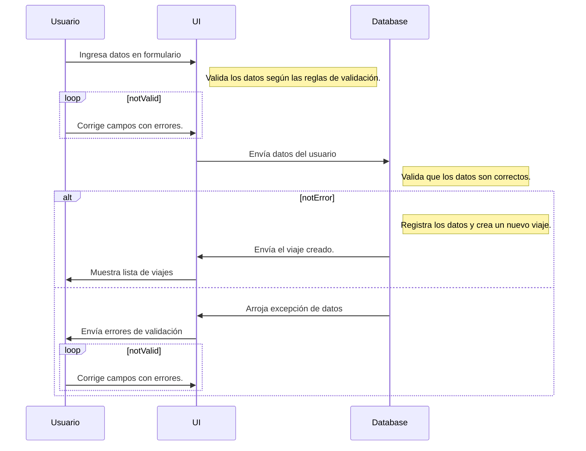

# Todo: Gestor de viajes

## Objetivos del sistema

- Poner en práctica los conocimientos y competencias en cuanto al diseño e implementación de interfaces innovadoras, aprovechando el potencial que ofrecen Ionic y otros framworks para integrar componentes llamativos, dinámicos y que interactúen con el dispositivo del usuario.

- Evidenciar el dominio adquirido en cuanto al diseño de interfaces y su interacción con el usuario, a través de la lógica de programación según paradigmas específicos y la relación de los elementos dentro de un proyecto de desarrollo.

- Fortalecer las competencias en cuanto al desarrollo de sistemas que interactúen de manera nativa con los dispositivos y el aprovechamiento de las tecnologías disponibles para compilar aplicaciones multiplataformas funcionales.

## Descripción general

ToGO es una sencilla aplicación móvil pensada para la planificación y gestión de viajes de turismo interno, ya que permite al usuario registrar lugares que desea visitar, calendarizar dichas visitas y establecer un nivel de prioridad de acuerdo al sitio en cuestión.

La interfaz de usuario de esta aplicación se compone de tres vistas básicas en las cuales se presentan los componentes de interacción con el sistema, además de otros elementos, las cuales son:

### Dashboard

Es la vista principal donde se presentará un resumen de los últimos lugares agregados o visitados por el usuario, así como algunos datos básicos para que éste tenga un control de sus viajes turísticos en cierto período.

Se muestra un calendario donde están señalados los viajes planificados por el usuario. El seleccionar una fecha que contenga viajes, éste podrá verlo con sus detalles, saber su estado y así llevar un control de las visitas que tiene pendiente.

### Nuevo Viaje

Incluye un formulario de registro que contiene interfaces de entrada de datos, con las cuales el usuario podrá ingresar la información necesaria para cada viaje, tales como: título del viaje, descripción, fecha y hora en que se realizará el viaje, prioridad del mismo y la principal dirección que se visitará. También contiene una interfaz innovadora que da acceso a la cámara del dispositivo a través de Córdova para agregar fotos al viaje.

Las interfaces de entrada de datos que se incluyen en esta vista son:

-  **Input Text:** Se utilizan para que el usuario ingrese datos en forma de texto alfanumérico para los campos de título y descripción. Contienen los atributos generales de los input text nativos de HTML5.

-  **DatePicker:** Se trata de un componente especial del Framework por medio del cual el usuario puede seleccionar una fecha determinada, a cual se parsea a formato 'YYYY-MM-DD' para ser almacenada.

-  **TimePicker:**  Es un componente similar al DatePicker, con la diferencia de que se utiliza para ingresar la hora, configurado en este caso para que se presente en formato 24H. Este y el anterior componente presentan al usuario un popup con una vista innovadora para seleccionar los datos.

-  **Select:**  Es un componente tipo DropDown con una lista desplegable de opciones entre las cuales el usuario puede elegir una o varias. En el caso de ToGO, permite elegir una opción entre varias para definir el nivel de prioridad del viaje a registrar.

-  **Autocomplete:**  Es un componente en el cual el usuario puede ingresar texto y, a través de una comunicación vía api, recupera coincidencias entre las cuales se puede elegir una. En este caso, se comunica con la api de Google Maps para recuperar direcciones y lugares según lo que el usuario digite.

-  **Camera:**  Es una interfaz integrada por medio del plugin de Córdova y que permite al usuario acceder a la cámara del dispositivo para tomar una o varias fotografías. Para que funcione adecuadamente, es necesario que el usuario suministre los permisos correspondientes.

### Lista de viajes

En esta vista, el usuario puede ver una lista de los viajes que tiene registrados, organizados según la fecha y la hora en que están planificados. Se presentan por medio de tarjetas, las cuales contienen: título del viaje, desripción, fecha y hora planificadas y prioridad. Además, contiene un botón desde el cual el usuario podrá ver la ubicación del viaje en un mapa.

Se presenta este listado en una vista de scroll infinito y se puede buscar utilizando un input text donde se ingresa el criterio de búsqueda y el sistema filtra los resultados según el título y la descripción de cada viaje registrado.

### Menú

Se trata de un menú expandible ubicado en forma vertical a la izquierda de la aplicación, desde donde el usuario puede navegar en las distintas vistas del sistema de manera fácil. Al corresponder al Layout principal, se renderiza una vez y aparece en todas las vistas.

Es un menú expandible, lo que significa que se puede ampliar su vista horizontalmente (para mostrar el texto de cada opción) o contraerlo (para mostrar sólo el título).

## Gestión de datos

ToGO utiliza un sistema de almacenamiento local, por lo que cada registro se guarda en la memoria del dispositivo y, por lo tanto, no requiere conexión a internet para funcionar. Sin embargo, la api de Google Maps sí requiere conexión para acceder a las ubicaciones y poder mostrar los datos correspondientes al usuario.

Cuenta con una store (tabla) local llamada "travels", donde se registran los objetos que corresponden a cada viaje. Este funciona mediante un modelo Javascript que permite gestionar las operaciones similares a una api (get, post, put y delete), permitiendo así trabajar y manipular los datos registrados de manera fácil y eficiente, con un tiempo de respuesta notablemente bajo.

La base de datos funciona por sistema de versionado, lo que permite que el sistema sea escalable a futuro, es decir, que se puedan añadir nuevos campos y funcionalidades sin afectar los datos registrados previamente, gracias al control de versiones.

# Diagramas y Esquemas

El sistema está planificado con base a los procesos principales que se espera realizar dentro del mismo, los cuales permitirán al usuario realizar cada una de las operaciones que corresponde según los objetivos de la aplicación.

## Casos de uso

Existen varios casos de usos considerados para el sistema y, de algunos de ellos, se desprenden otros que ayudan a una mejor organización de sus funciones y demás aspectos. Para la fase inicial, se han considerado los siguientes tres esquemas:

## Diagramas UML

### Registro de viaje

